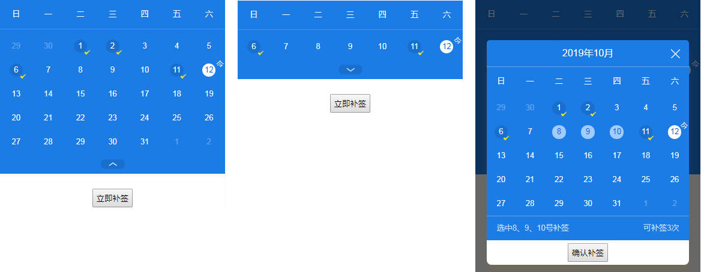
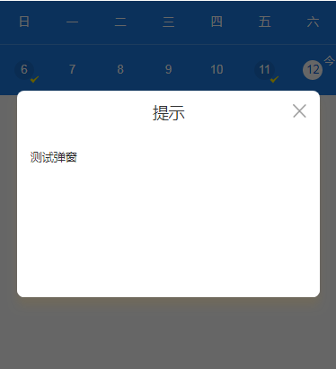

# 自定义签到日历组件以及自定义对话框

> 这个是在很短时间内赶制出来的，代码没有进行提炼，有兴趣的朋友可以提炼下代码
> 简单实现了当前周和当前月的展开收起切换，如需更复杂的功能可以去扩展
> 另外包含一个简单的对话框组件


## 签到日历
### 图片


### 属性/方法说明
- weekstart
    - type:Number
    - default:7
    - des:第一列是星期几，默认是星期天

- signeddates
    - type:Array    
    - default:null
    - des:已经签到的日期

- maxchoose
    - type:Number
    - default:0
    - des:最大可选择数

- choosecallback
    - type:Function
    - default:空函数
    - des:选择日期后的回调

- open
    - type:Boolean
    - default:true
    - des:是否展开，显示整月数据
- showtop
    - type:Boolean
    - default:true
    - des:显示顶部，即2019年10月和关闭按钮这栏目
- showopenbtn
    - type:Boolean
    - default:true
    - des:显示底部伸缩按钮
- showopenbtn
    - type:Boolean
    - default:false
    - des:禁用点击事件，禁用后不能选择日期


<hr>
## 对话框

### 图片


### 属性/方法说明

- title
    - type:String
    - default:'提示'
    - des:头部标题
- showheader
    - type:Boolean
    - default:true
    - des:是否显示头部
- showfooter
    - type:Boolean
    - default:true
    - des:是否显示底部
- visible
    - type:Boolean
    - default:false
    - des:控制对话框是否显示，记得跟上`sync`修饰符，使用例子 `:visible.sync="repairSignDialog"`
- width
    - type:String
    - default:"90%"
    - des:对话框宽度，可以使用px或者其他单位
- modal
    - type:Boolean
    - default:true
    - des:是否需要遮罩层
- customclass
    - type:String
    - default:""
    - des:Dialog 的自定义类名
- showclose
    - type:Boolean
    - default:true
    - des:显示关闭按钮
- closeonclickmodal
    - type:Boolean
    - default:true
    - des:通过点击 modal 关闭 Dialog
- closeout
    - type:Boolean
    - default:false
    - des:关闭按钮在外部
- closeimg
    - type:String
    - default:null
    - des:关闭自定义图片
- closecallback
    - type:Function
    - des:关闭后回调函数
- beforeclose
    - type:Function
    - des:关闭前的回调，父组件函数要传入done，然后调用done()才会往下执行
    ```js
        methods:{
            beforeclose(done){
                dosomething
                done();//不调用不会往下执行
            }
        }
    ```
- center
    - type:Boolean
    - default:false
    - des:头部和底部采用居中布局
- radius
    - type:Boolean
    - default:true
    - des:边框圆角
- top
    - type:String
    - default:"15%"
    - des:距离顶部位置，通用可以使用px获取其他单位


> 小弟入vue的时间不是很长，各方面都不太熟练，这两控件放出来献丑了
> 用得上的朋友之间拿去用吧，欢迎多多指教

